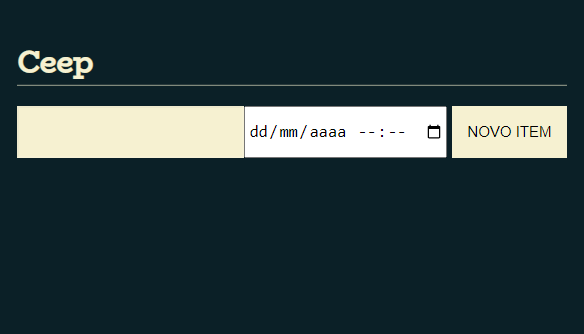

## 
 Sistema CEEP

* Projeto: https://diegonf.github.io/Studies__FrontEndJS__CEEP/
* Curso: JS na Web: Manipule o DOM com JavaScript!
* Instituição: [Alura](https://www.alura.com.br)

## Descrição do projeto
O Projeto CEEP foi desenvolvido no curso JS na Web, da Formação Front-End da Alura.
O objetivo desse projeto foi conhecer a linguagem javascript, manipular o DOM utilizando o JS, e trabalhar com a lógica de programação para criar um sistema de todo list, com a opção de adicionar tarefas com data e hora prevista de termino, e com opção de concluir/deletar tarefas. 

## Funcionalidades
* Adição de tarefas a serem executadas;
* Adição de data e hora de término para cada tarefa;
* Aglomeração das tarefas de mesma data de forma automática;
* Botão para concluir ou deletar a tarefa

## Técnologias utilizadas
*  
* 
* 

## Autores
| [ Diego Ferreira](https://github.com/diegonf) | 
| :---: |